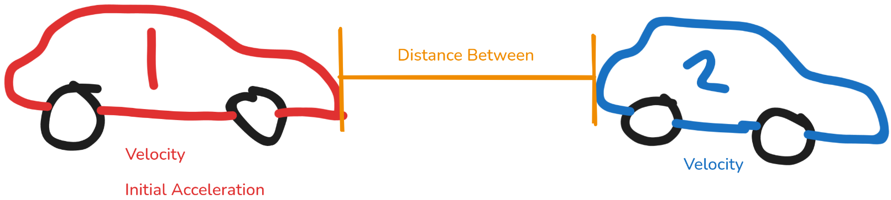
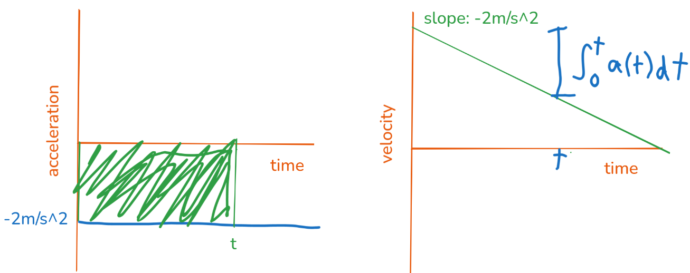

# Presentation about my presentation, *Physics, Calculus, and Safe Driving*
Rajas Paranjpe

---
# Why
- I like teaching people
  - Especially topics that I'm interested in
- I like physics
- I like using calculus as a tool, and want to show people how calculus is a useful tool

---
# Presentation Audience
- Mrs. Reyes's period 3 HPC class (I think 10-11th graders, but u guys know there is always that 9th grader who skipped a bajillion math classes so I'm not 100% sure)
- Mr. Ra's period 6 Algebra 1 class (all 9th graders) 

---

# The Content
In my presentation:

## A car is driving behind another car in the same lane. Is it leaving enough space between the two cars?

---
**I explained how calculus can help with this problem**

# Formula for velocity with constant acceleration
$$
velocity = initial\ velocity + acceleration \times time
$$

# Formula for position with constant velocity
$$
position = initial position + velocity * time
$$

# Formula for position with non-constant velocity
$$
position = \ ?
$$

This is where calculus helps us!

---

Before the math content, I asked them:

# Quick Survey
When are you planning on driving?
- I already drive / am learning
- I will learn 1 year
- I will learn after 1 year
- I don't plan on learning how to drive

Do you have an (older sibling or friend) who drives?

**Many people in HPC said they were driving / learning, while most people in Algebra I said they had an older friend or sibling who drives**

---
And then I asked them:

## Trivia!
What is a safe following distance (the distance you keep between your car and the car in front of you in your lane when driving)?

**Sadly, everyone got this wrong, with answers like "1 meter", "1 car", and "3 cars"**

---

**I briefly explained integrals**
# $\int$ Integrals $\int$
This is an integral sign: $\int$

Integrals tell you the accumulation of a rate over time

We can write equations for velocity and position like this.
$$
position(t) = initial\ position + \int_{0}^{t} velocity(t) \,dt
$$
where $t$ represents time

Even when the rate function isn't linear, calculus can be used to find the function of the accumulation of the rate function.

---

**For the HPC students, I explained how integrals relate to area under the curve**
# Area "under" the curve
Another way to think of an integral is a math tool that takes a function and gives you the area "under" the function.

---
Then, I gave them some equations and some values for variables such as initial velocity, acceleration, etc. I asked them to use their calculutors to find an answer.

HPC students: were not at all interested in doing the calculations (which is fair) (maybe I was not loud enough or something)

Algebra 1 students: Took out their calculators, but no one was able to solve it.

I thought this would be doable even for Algebra 1 students, since I gave them the equations and they just needed to plug in the numbers, but I think they were only used to using letters like $a$, $b$, $c$, and not physics-y notation like $v_{a,0}$. 

Reflection: I should have made the equation have simpler variables.

---
Then I showed them this simulation: https://following-distance.netlify.app/

Made using:
Rust (A language empowering everyone to build reliable and efficient software.) (The best programming language)

Iced (A cross-platform GUI library for Rust focused on simplicity and type-safety.)

I asked if anyone wanted to volunteer to adjust the values in the simulation.

---
Then I showed them this meme and explained it to them.

---

# Some Feedback I received (from HPC)

## "If so, what did you learn? If not, why not?"
"I learned that acceleration is the rate of change of velocity"

"Real Life Application of Integrals"

"I learnt pretty much all of it in Physics"

"What acceleration is."

"I learned about how we use calculus and area under the curve to manipulate different variables and test whether certain scenarios result in cars crashing or not."

"about velocity"

---
## "What did you enjoy most about the presentation?"
"the simulation at the end"
"The simulation"
"The simulation was fun and interactive."
"The simulation."
"I was impressed by the simulation that Rajas made and presented at the end of his presentation."
"I liked the interactive car activity."
"I enjoyed the demonstration with the website that showed how different variables, such as breaking time and distance between the cars, affect the outcome."
"I enjoyed the simulation"
"the sim"

---
# What I learned from the experience
- To really explain a topic you have to pause and give people time to think, understand, ask questions, and go back and explain things. I didn't have enough time for this.
- I understand how my English teacher Mrs. Teczon feels when our entire class just stares blankly without talking at all. That's kind of how it felt presenting to HPC. Algebra 1 students seemed more engaged.

---
# The best question I was asked
Before I started my presentation to Mr. Ra's class, I plugged in my Chromebook to the screen. And a kid asked me:

"Do you use Linux?"

Very nice to hear.

Btw I use ~~Arch~~ NixOS

---
# Final Slide
Happy last (like fr last last) day of school. It was good being in MVC with you all. I probably won't see any of you again. If you want to stay in touch with me:

Email: paranjperajas@gmail.com
Discord: chocolateloverraj
GitHub: ChocolateLoverRaj
Mastodon: https://mastodon.social/@chocolateloverraj
Phone: *ask me, I didn't put it here since this is posted on the internet*

All content and code for this presentation is available at https://github.com/ChocolateLoverRaj/mvc-lecture
