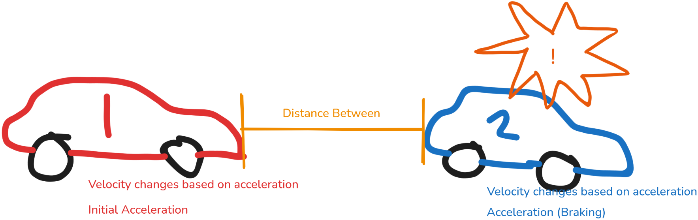
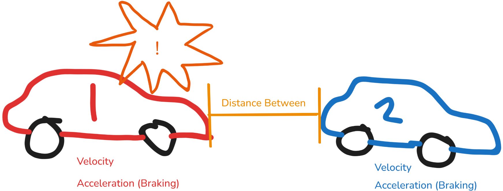
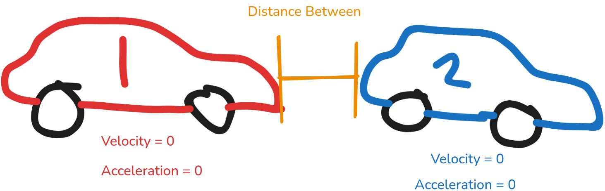

# Physics, Calculus, and Safe Driving

---
# Quick Survey
When are you planning on driving?
- I already drive / am learning
- I will learn 1 year
- I will learn after 1 year
- I don't plan on learning how to drive

Do you have an (older sibling or friend) who drives?

---
# Math / physics topics related to driving
- Acceleration
- Fuel efficiency
- How gas and electric cars are powered
- Braking
- Signal light timings
- Traction
- and more

In this lecture I will talk about a safe following distance and yellow light timing (if there is time).

---

# Safe Following Distance

## Trivia!
What is a safe following distance (the distance you keep between your car and the car in front of you in your lane when driving)?

---

# Following Distance

According to the CA DMV
> Tailgating makes it harder for you to see the road ahead because the vehicle in front of you blocks your view. You will not have enough time to react if the driver in front of you brakes suddenly. Use the three-second rule to ensure a safe following distance and avoid a collision.

## So Basically
- There is a chance that the car in front of you brakes suddently
  - If you're too close, your car will crash
  - If there is enough distance, you can brake and stop in time without crashing

---

## Physics Terms

Position                                                                                                  | Velocity                                                                                                                      | Acceleration
----------------------------------------------------------------------------------------------------------|-------------------------------------------------------------------------------------------------------------------------------|-----------------------------------------------------------------------------------------------------------------------------
 |  | 

---

# The Scenario
## A car is driving behind another car in the same lane. Is it leaving enough space between the two cars?

---
## The car in front suddenly starts braking

---
## The car behind reacts and also starts braking

---
## Both cars eventually come to a stop

But $car\ 1\ position = car\ 2\ position$ before both cars come to a stop, the cars will collide. We need to not let this happen when driving. 

---
# Formula for velocity with constant acceleration
$$
velocity = initial\ velocity + acceleration \times time
$$

# Formula for position with constant velocity
$$
position = initial position + velocity * time
$$

# Formula for position with non-constant velocity
$$
position = \ ?
$$

This is where calculus helps us!

---
# $\int$ Integrals $\int$
This is an integral sign: $\int$

Integrals tell you the accumulation of a rate over time

We can write equations for velocity and position like this.
$$
velocity(t) = initial\ velocity + \int_{0}^{t} acceleration(t) \,dt
$$
$$
position(t) = initial\ position + \int_{0}^{t} velocity(t) \,dt
$$
where $t$ represents time

Even when the rate function isn't linear, calculus can be used to find the function of the accumulation of the rate function.

---
# Area "under" the curve
Another way to think of an integral is a math tool that takes a function and gives you the area "under" the function.

---
# Formulas for our scenario
Before car 1 reacts, car 1 will have an acceleration of 0 and a constant positive velocity.
$$
p_{a}(t) = p_{a,0} + \int_{0}^{t}v_{a}dt = p_{a,0} + v_{a}t
$$
$$
v_{b}(t) = v_{a,0} + \int_{0}^{t}a_{b}dt = v_{b,0} + a_{b}t
$$
$$
p_{b}(t) = p_{b,0} + \int_{0}^{t}v_{b}(t)dt = p_{b,0} + \int_{0}^{t}(v_{a,0} + a_{a}t)dt = p_{b,0} + v_{b,0}t + \frac{1}{2} a_{b}t^2
$$
I won't get into the details of calculating the integrals, but you will learn that in Calculus class. You can also evaluate integrals with advanced calculators such as Desmos or [Qalculate!](https://qalculate.github.io/).

---
# Will they crash before car 1 even starts braking?
From our previous equations, we know that the cars will not crash if
$$
p_{a,0} + v_{a}t < p_{b,0} + v_{b,0}t + \frac{1}{2} a_{b}t^2
$$
Let's say both cars are initially going at 30m/s (~67mph) and the car in front is slowing down at a rate of 6.9m/s^2. The distance between the two cars is 90m (because they were following the 3 second rule). Will the car crash within 2s?

Hint: You can plug in $p_{a,0} = 0m$ and $p_{b,0} = 90m$.

---
# Before reacting - plugging in the numbers
$p_{a,0} = 0m$, $p_{b,0} = 90m$, $v_{a}=30m/s$, $v_{b,0} = 30m/s$, $a_{b} = -6.9m/s^2$, $t=2s$

$$
p_{a,0} + v_{a}t < p_{b,0} + v_{b,0}t + \frac{1}{2} a_{b}t^2
$$

$$
0m + 30m/s * 2s < 90m + 30m/s * 2s + \frac{1}{2} -6.9m/s^2 * (2s)^2
$$

$$
60m < 136.2m
$$

So the cars are now $76.2m$ apart. They got closer, but they did not crash within 2 seconds.

---
# After reacting
Reaction time can vary, but for this example we assume a reaction time of 2s. After 2s, the car behind also brakes. Even after this point, there is still a chance of a crash.

## The scenario
$v_{a,0} = 30m/s$, $a_{a} = -6m/s^2$, $v_{b,0} = 16.2m/s$, $a_{b} = -6.9m/s^2$, distance between them: $76.2m$.

$$
p_{a}(t) = p_{a,0} + v_{a,0}t + \frac{1}{2} a_{a}t^2
$$

$$
p_{b}(t) = p_{b,0} + v_{b,0}t + \frac{1}{2} a_{b}t^2
$$

Will both cars come to a stop with distance in between them?

---
# After reacting - plugging in the numbers
Assuming that there are no collisions, we can find the time when both cars will stop with $v_{a}(t) = 0$ and $v_{b}(t) = 0$ 

$v_{a,0} = 30m/s$, $a_{a} = -6m/s^2$, $v_{b,0} = 16.2m/s$, $a_{b} = -6.9m/s^2$

$$
v_{a,0} + a_{a}t = 0m/s
$$
$$
30m/s - 6m/s^2 * t = 0m/s
$$
$$
t = 5s
$$

$$
v_{b,0} + a_{b}t = 0m/s
$$
$$
16.2m/s - 6.9m/s^2 * t = 0m/s
$$
$$
t = 2.347s
$$

So car $b$ will stop first, and it will have a velocity and acceleration of $0$. It won't drive backwards (we will assume).

---
# Plugging in $t$
$v_{a,0} = 30m/s$, $a_{a} = -6m/s^2$, $v_{b,0} = 16.2m/s$, $a_{b} = -6.9m/s^2$, distance between them: $76.2m$.

$$
p_{b}(t) = p_{b,0} + v_{b,0}t + \frac{1}{2} a_{b}t^2
$$
$$
p_{b}(2.347s) = 76.2m + 16.2m/s * 2.347s + \frac{1}{2} * -6.9m/s^2 * (2.347s)^2 = 95.217m
$$

$$
p_{a}(t) = p_{a,0} + v_{a,0}t + \frac{1}{2} a_{a}t^2
$$
$$
p_{a}(5s) = 0m + 30m/s * 5s + \frac{1}{2} * -6m/s^2 * (5s)^2 = 75m
$$

Both cars will stop without crashing, with a distance of ~$20m$ between them when they stop. $20m$ is not that much considering that they started with $90m$ between them.

---
# Variables to consider
- The initial speed of both cars
- How much space is between the cars
- The braking (acceleration) capability of the two cars
- Road conditions
- How fast the car ahead slows down (may not always be maximum braking)
- Reaction time of the driver behind, which is affected by being distracted, sleepy, or drunk

And remember, when you're driving, slamming the brakes is not always the best solution in emergency situtations. Sometimes it's better to speed up or turn the steering wheel.

---

